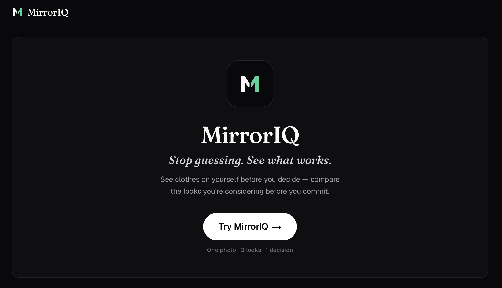
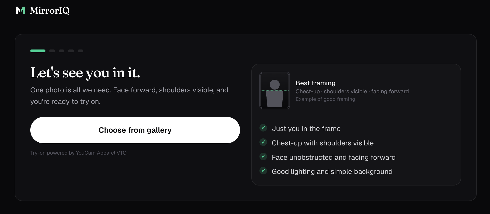
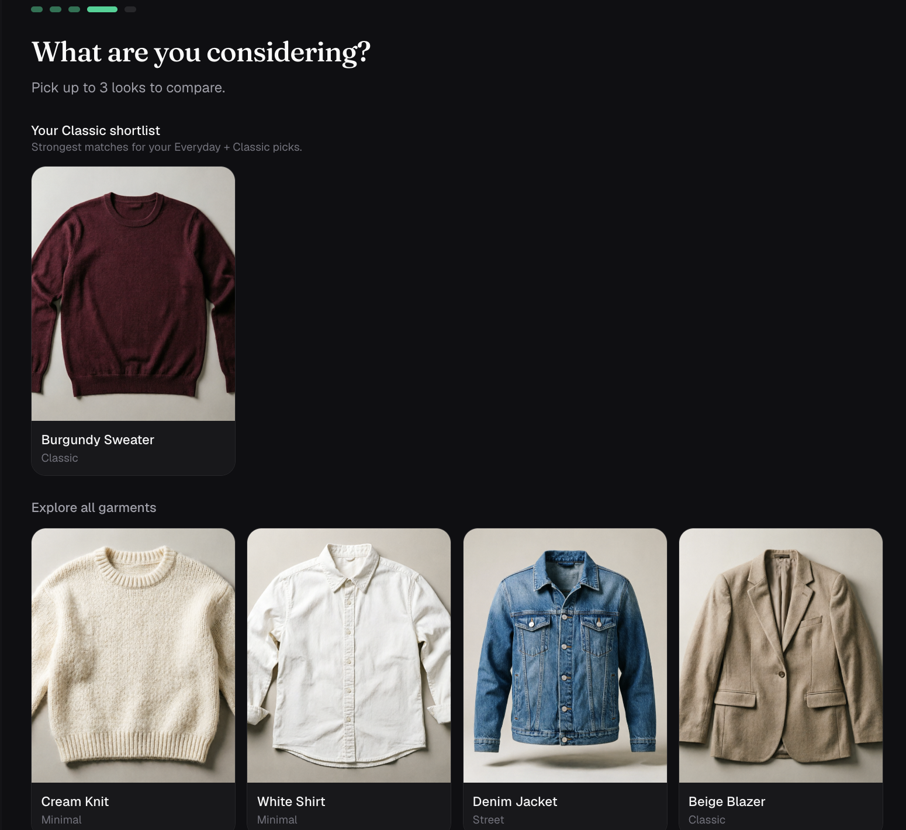
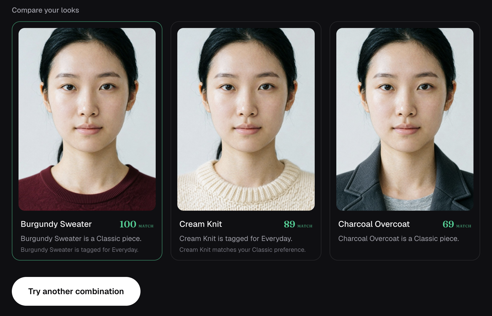
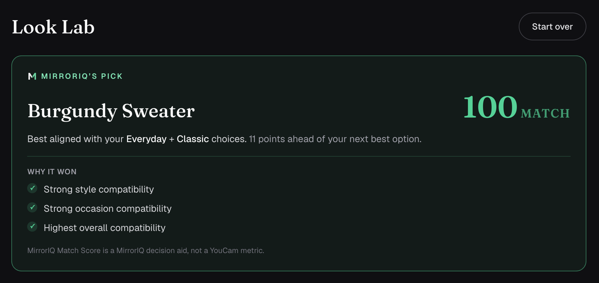

# MirrorIQ

**Stop guessing. See what works.**

MirrorIQ is a visual fashion decision engine that helps shoppers compare the clothes they are considering on themselves before committing to a purchase.

Built for the **YouCam API Skin AI & Apparel VTO Hackathon** — Apparel VTO track.

<p align="center">
  
</p>

---

## The Problem

Online fashion shopping forces people to guess whether a look will actually work for them. Standard virtual try-on tools generate one image at a time, leaving the user to mentally compare options with no structured way to decide between them.

## The Solution

MirrorIQ lets a user upload **one photo**, select an occasion and style preference, choose 1–3 garments they're considering, and instantly see them all on themselves side by side. It then calculates a transparent **Match Score** to recommend the strongest option.

> **YouCam VTO = visualization engine.**
> **MirrorIQ = decision engine.**

YouCam renders what a garment looks like on you. MirrorIQ is the layer on top that turns that rendering into a decision: which of the options you're already considering actually fits your stated intent — and why.

---

## Product Flow

| Step | What happens |
|---|---|
| 1. Photo | Upload or capture one clear, front-facing photo with shoulders visible. |
| 2. Intent | Select an occasion (Everyday, Work, Date Night, Party) and a style (Minimal, Street, Classic). |
| 3. Garments | Pick 1–3 garments from a 10-piece catalog — MirrorIQ surfaces your best-matching options first as a shortlist, then the rest to explore freely. |
| 4. Generate | YouCam Apparel VTO renders each garment on your photo. Looks reveal into Look Lab as each one finishes — no separate waiting screen. |
| 5. Decide | Compare the looks side by side, see each one's Match Score, and get MirrorIQ's Pick with a transparent explanation of why it won. |

<p align="center">
  
  <br /><em>One photo, clear framing guidance, camera capture on mobile.</em>
</p>

<p align="center">
  
  <br /><em>Garments are prioritized by your stated intent — "Your Classic shortlist" surfaces first, the full catalog stays one scroll away.</em>
</p>

<p align="center">
  
  <br /><em>Look Lab: real YouCam Apparel VTO renders, compared side by side with a Match Score per look.</em>
</p>

<p align="center">
  
  <br /><em>MirrorIQ's Pick — a deterministic recommendation with a transparent "why it won" breakdown.</em>
</p>

---

## Key Features

- **One-photo architecture** — a single upload drives every garment comparison; no re-uploading per look.
- **Intent-based prioritization** — occasion + style selections visibly reorder the garment picker into a shortlist before the full catalog, without ever hiding options.
- **Live progressive reveal** — Look Lab renders immediately; each card fills in as its YouCam try-on completes, using only real, honest status stages (no fabricated progress percentages).
- **Deterministic Match Score** — a transparent, rule-based compatibility score computed entirely by MirrorIQ, with reasoning drawn only from real signals (never fabricated).
- **Camera-aware capture** — offers native camera capture only on devices where it actually works (mobile/tablet); desktop gets a clean gallery-upload-only flow instead of a button that silently does nothing.
- **Accessible & mobile-first** — semantic controls, visible focus states, `prefers-reduced-motion` support, and a UI designed first for 375–430px screens.
- **DEMO_MODE** — a fully working offline demo path that exercises the entire UI without consuming YouCam API units or making network calls to YouCam.

---

## YouCam Apparel VTO Integration

MirrorIQ integrates **Perfect Corp. YouCam Apparel Virtual Try-On (V4)**.

### Server-side architecture

All YouCam API interactions are handled server-side via Next.js API routes (`/api/vto`, `/api/vto/status`). The API key never reaches the browser.

### Why `src_file_id` and presigned uploads?

While the YouCam API documentation mentions `src_file_url`, their servers cannot reliably fetch from arbitrary public URLs due to hotlink protection and CDN restrictions (resulting in `error_download_image`).

To ensure reliability, MirrorIQ implements the official **presigned S3 upload flow**:
1. `POST /s2s/v2.0/file` to get a presigned PUT URL and `file_id`.
2. `PUT` the binary image directly to Amazon S3.
3. Submit the VTO task using `src_file_id` and `ref_file_id`.

### Polling, not webhooks

VTO generation is asynchronous. MirrorIQ polls `/api/vto/status` on a fixed interval with a bounded attempt count, surfacing each garment's real stage (`Preparing garment` → `Submitting try-on` → `Generating your look` → `Finishing your preview`) as it progresses — never a fabricated percentage or ETA.

---

## Match Score

The **MirrorIQ Match Score** is a deterministic, transparent heuristic calculated by MirrorIQ — **not** by YouCam. It's based on:
- Style preference compatibility
- Occasion compatibility
- Garment style/occasion tags

It's an experimental product feature to help users articulate *why* a look works for their stated intent. It makes no scientific, medical, or objective-attractiveness claims, and every "why it won" reason shown in the UI is a real, computed fact — never invented copy.

---

## Tech Stack

- **Next.js 16** (App Router, Turbopack) + **React 19** + **TypeScript**
- **Tailwind CSS v4**
- **Fraunces** (display serif) + **Geist** (UI sans), via `next/font`
- No database, no auth, no additional third-party APIs — kept deliberately minimal for a focused hackathon scope

---

## Getting Started

### Prerequisites

- Node.js 20+
- A YouCam / Perfect Corp API key (only required for live mode — see below)

### Install

```bash
npm install
```

### Configure environment

```bash
cp .env.example .env.local
```

Then edit `.env.local`:

| Variable | Description |
|---|---|
| `DEMO_MODE` | `true` runs the full UI with canned responses and **zero** YouCam network calls or unit consumption. `false` makes live YouCam Apparel VTO calls. |
| `YOUCAM_API_KEY` | Your Perfect Corp / YouCam API key. Only required when `DEMO_MODE=false`. Never commit this. |
| `YOUCAM_BASE_URL` | YouCam S2S API base URL. |
| `YOUCAM_AUTH_STYLE` | Auth header style (`bearer`). |
| `YOUCAM_VTO_SUBMIT_PATH` / `YOUCAM_VTO_STATUS_PATH_TEMPLATE` | Apparel VTO (cloth-v4) task endpoints. |
| `YOUCAM_TIMEOUT_MS` | Per-request timeout to the YouCam API. |
| `YOUCAM_LOG_SHAPE` | Debug flag: logs response *structure* only (keys/types/lengths, never values). |

### Run

```bash
npm run dev
```

Open [http://localhost:3000](http://localhost:3000). With `DEMO_MODE=true` (the default), the entire flow — photo, intent, garments, generation, and Look Lab — works immediately with no API key needed, which is the fastest way for judges to review the product end to end.

**No photo handy?** `public/test-persons/test-man.png` and `test-woman.png` are AI-generated sample photos (not real people) included specifically so reviewers can try the full upload → try-on flow without needing their own picture.

### Verify

```bash
npm run lint
npm run build
```

---

## Project Structure

```
app/
  page.tsx                 # Flow orchestration (state machine across screens)
  components/screens/       # One component per screen (Landing, Photo, Garments, Look Lab, ...)
  components/ui.tsx         # Shared design-system primitives (buttons, cards, brand mark)
  api/vto/                  # Server-side YouCam VTO submit + status routes
lib/
  youcam/                   # YouCam client, upload, normalize, config (server-only)
  scoring/matchScore.ts      # The deterministic Match Score algorithm
data/garments.ts            # The 10-piece garment catalog
public/garments/             # Original AI-generated garment packshots
public/brand/                 # MirrorIQ logo/icon assets
```

---

## Accessibility & Performance

- Semantic `<button>` controls throughout, with `aria-pressed`/`aria-live` where relevant
- Visible focus rings on every interactive element
- Full `prefers-reduced-motion` support (all animation is `motion-safe`-gated, with a global fallback)
- Mobile-first layout, verified at 375×812, 390×844, 430×932, and 1280–1440px desktop
- Images sized via CSS aspect ratios to avoid layout shift; lazy-loaded where off the critical path
- `DEMO_MODE` makes zero network calls to YouCam, so local development and demoing never costs API units

## Assets

All 10 garment packshots and the MirrorIQ logo/icon are original, AI-generated assets created for this project — no third-party brands, logos, or copyrighted imagery are used.

## Scope Notes

This build intentionally excludes Skin AI, accounts, payments, a database, and any LLM-powered features — MirrorIQ is scoped as a focused Apparel VTO decision tool, not a general AI stylist.
